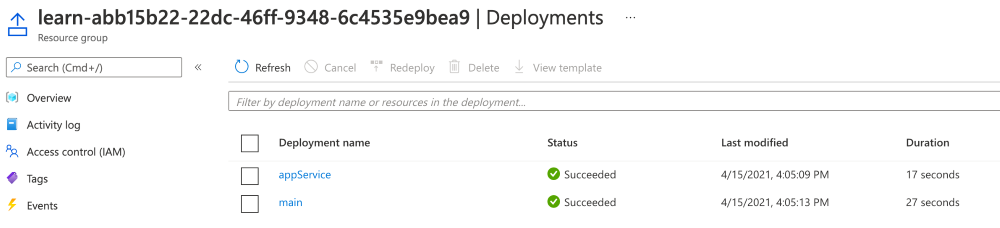
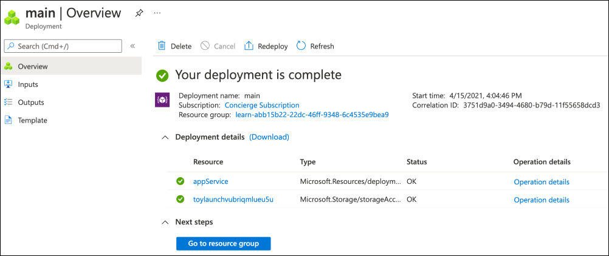
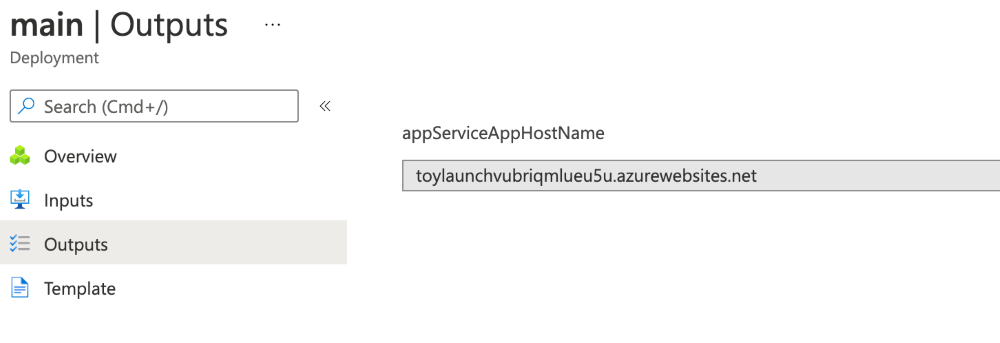
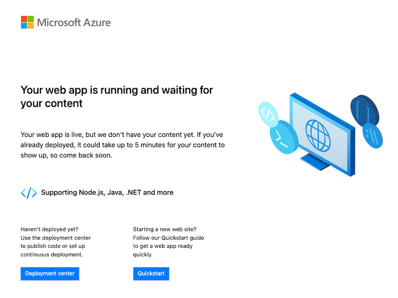

# Lab 03 - Refactor your template to use modules

## Lab Scenario

## Lab objectives

## Estimated timing: 60 minutes

### Exercise 1: Add a new module file

1. In Visual Studio Code, create a new folder called modules in the same folder where you created your main.bicep file. In the modules folder, create a file called appService.bicep. Save the file.

2. Add the following content into the appService.bicep file:

    ```
    param location string
    param appServiceAppName string
    
    @allowed([
      'nonprod'
      'prod'
    ])
    param environmentType string
    
    var appServicePlanName = 'toy-product-launch-plan'
    var appServicePlanSkuName = (environmentType == 'prod') ? 'P2v3' : 'F1'
    
    resource appServicePlan 'Microsoft.Web/serverFarms@2022-03-01' = {
      name: appServicePlanName
      location: location
      sku: {
        name: appServicePlanSkuName
      }
    }
    
    resource appServiceApp 'Microsoft.Web/sites@2022-03-01' = {
      name: appServiceAppName
      location: location
      properties: {
        serverFarmId: appServicePlan.id
        httpsOnly: true
      }
    }
    ```
    
3. Save the changes to the file. Notice that Visual Studio Code doesn't show you any red squiggles to indicate warnings about missing variables, missing parameters, or invalid resources.

### Task 2: Add a reference to the module from the parent template

1. In the main.bicep file, delete the App Service resources and the appServicePlanName and appServicePlanSkuName variable definitions. Don't delete the App Service parameters, because you still need them. Also, don't delete the storage account parameters, variable, or resources.

2. At the bottom of the main.bicep file, add the following Bicep code:

    ```
    module appService 'modules/appService.bicep' = {
      name: 'appService'
      params: {
        location: location
        appServiceAppName: appServiceAppName
        environmentType: environmentType
      }
    }
    ```
    
3. Save the changes to the file.

### Task 3: Add the host name as an output

1. Add the following Bicep code at the bottom of the appService.bicep file:

    ```
    output appServiceAppHostName string = appServiceApp.properties.defaultHostName
    ```
    
1. Save the changes to the file.
   This output is declared within a Bicep file we'll use as a module, so it's going to be available only to the parent template. You also need to return the output to the person who deployed the template.

1. Open the main.bicep file and add the following code at the bottom of the file:

    ```
    output appServiceAppHostName string = appService.outputs.appServiceAppHostName
    ```

1. Save the changes to the file.

### Task 4: Verify your Bicep files

1. After you've completed all of the preceding changes, your main.bicep file should look like this example:

    ```
    param location string = 'westus3'
    param storageAccountName string = 'toylaunch${uniqueString(resourceGroup().id)}'
    param appServiceAppName string = 'toylaunch${uniqueString(resourceGroup().id)}'
    
    @allowed([
      'nonprod'
      'prod'
    ])
    param environmentType string
    
    var storageAccountSkuName = (environmentType == 'prod') ? 'Standard_GRS' : 'Standard_LRS'
    
    resource storageAccount 'Microsoft.Storage/storageAccounts@2022-09-01' = {
      name: storageAccountName
      location: location
      sku: {
        name: storageAccountSkuName
      }
      kind: 'StorageV2'
      properties: {
        accessTier: 'Hot'
      }
    }
    
    module appService 'modules/appService.bicep' = {
      name: 'appService'
      params: {
        location: location
        appServiceAppName: appServiceAppName
        environmentType: environmentType
      }
    }
    
    output appServiceAppHostName string = appService.outputs.appServiceAppHostName
    ```

1. Your appService.bicep file should look like this example:

    ```
    param location string
    param appServiceAppName string
    
    @allowed([
      'nonprod'
      'prod'
    ])
    param environmentType string
    
    var appServicePlanName = 'toy-product-launch-plan'
    var appServicePlanSkuName = (environmentType == 'prod') ? 'P2v3' : 'F1'
    
    resource appServicePlan 'Microsoft.Web/serverFarms@2022-03-01' = {
      name: appServicePlanName
      location: location
      sku: {
        name: appServicePlanSkuName
      }
    }
    
    resource appServiceApp 'Microsoft.Web/sites@2022-03-01' = {
      name: appServiceAppName
      location: location
      properties: {
        serverFarmId: appServicePlan.id
        httpsOnly: true
      }
    }
    
    output appServiceAppHostName string = appServiceApp.properties.defaultHostName
    ```
    
### Deploy the updated Bicep template

1. Run the following Azure PowerShell command in the terminal.

    ```
    New-AzResourceGroupDeployment -TemplateFile main.bicep -environmentType nonprod
    ```

### Check your deployment

1. In your browser, go back to the Azure portal. Go to your resource group, and you'll see that there are now two successful deployments.

1. Select the 2 Succeeded link. Notice that you have a deployment called main in the list, and a new deployment called appService.

    

1. Select the deployment called main, then select Deployment details to expand the list of deployed resources.

    

1. Select the Outputs tab. Notice that there's an output called appServiceAppHostName with the host name of your App Service app. Copy the host name to your clipboard.

    

1. Open a new browser tab and paste the host name that you copied. You should see the default App Service welcome page.

    

Congratulations! You've successfully deployed the foundations for a great app.
