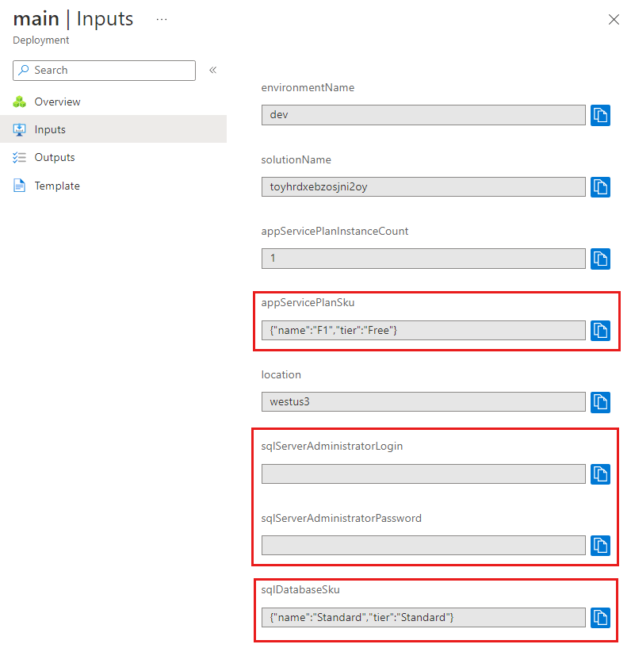

# Lab 01 - Add a parameter file and secure parameters

## Lab Scenario

## Lab objectives

## Estimated timing: 60 minutes

### Task 1: Remove the default value for the App Service plan SKU

To make your template work across environments, the Azure App Service plan's SKU details will be provided in a parameter file rather than by a default value.

1. In the main.bicep file in Visual Studio Code, update the appServicePlanSku parameter to remove its default value.

    ```
    @description('The name and tier of the App Service plan SKU.')
    param appServicePlanSku object
    ```
1. Now to Add new parameters,you need to add a SQL server and database. First, you'll add parameters for the administrator login and password, and the database SKU. You'll set their values later.
2. In the main.bicep file in Visual Studio Code, add the sqlServerAdministratorLogin, sqlServerAdministratorPassword, and sqlDatabaseSku parameters underneath the current parameter declarations. When you're finished, your parameter declarations should look like this example:

    ```
    @description('The name of the environment. This must be dev, test, or prod.')
    @allowed([
      'dev'
      'test'
      'prod'
    ])
    param environmentName string = 'dev'
    
    @description('The unique name of the solution. This is used to ensure that resource names are unique.')
    @minLength(5)
    @maxLength(30)
    param solutionName string = 'toyhr${uniqueString(resourceGroup().id)}'
    
    @description('The number of App Service plan instances.')
    @minValue(1)
    @maxValue(10)
    param appServicePlanInstanceCount int = 1
    
    @description('The name and tier of the App Service plan SKU.')
    param appServicePlanSku object
    
    @description('The Azure region into which the resources should be deployed.')
    param location string = 'westus3'
    
    @secure()
    @description('The administrator login username for the SQL server.')
    param sqlServerAdministratorLogin string
    
    @secure()
    @description('The administrator login password for the SQL server.')
    param sqlServerAdministratorPassword string
    
    @description('The name and tier of the SQL database SKU.')
    param sqlDatabaseSku object
    ```
    **Note**: Notice that you're not specifying default values for the sqlServerAdministratorLogin and sqlServerAdministratorPassword parameters. It's bad security practice to add default values for secure parameters. Also, you're not specifying a default value for sqlDatabaseSku. You'll specify a value in a parameter file.

1. Now to add new variables, In the main.bicep file in Visual Studio Code, add the sqlServerName and sqlDatabaseName variables underneath the existing variables. When you're finished, your variable declarations should look like this example:

    ```
    var appServicePlanName = '${environmentName}-${solutionName}-plan'
    var appServiceAppName = '${environmentName}-${solutionName}-app'
    var sqlServerName = '${environmentName}-${solutionName}-sql'
    var sqlDatabaseName = 'Employees'
    ```
1. Now, Add SQL server and database resources, In the main.bicep file in Visual Studio Code, add the following code to the bottom of the file:

    ```
    resource sqlServer 'Microsoft.Sql/servers@2022-05-01-preview' = {
      name: sqlServerName
      location: location
      properties: {
        administratorLogin: sqlServerAdministratorLogin
        administratorLoginPassword: sqlServerAdministratorPassword
      }
    }
    
    resource sqlDatabase 'Microsoft.Sql/servers/databases@2022-05-01-preview' = {
      parent: sqlServer
      name: sqlDatabaseName
      location: location
      sku: {
        name: sqlDatabaseSku.name
        tier: sqlDatabaseSku.tier
      }
    }
    ```
1. Save the changes to the file.

### Task 2: Verify your Bicep file

1. After you've completed all of the preceding changes, your Bicep file should look like this example:

    ```
    @description('The name of the environment. This must be dev, test, or prod.')
    @allowed([
      'dev'
      'test'
      'prod'
    ])
    param environmentName string = 'dev'
    
    @description('The unique name of the solution. This is used to ensure that resource names are unique.')
    @minLength(5)
    @maxLength(30)
    param solutionName string = 'toyhr${uniqueString(resourceGroup().id)}'
    
    @description('The number of App Service plan instances.')
    @minValue(1)
    @maxValue(10)
    param appServicePlanInstanceCount int = 1
    
    @description('The name and tier of the App Service plan SKU.')
    param appServicePlanSku object
    
    @description('The Azure region into which the resources should be deployed.')
    param location string = 'westus3'
    
    @secure()
    @description('The administrator login username for the SQL server.')
    param sqlServerAdministratorLogin string
    
    @secure()
    @description('The administrator login password for the SQL server.')
    param sqlServerAdministratorPassword string
    
    @description('The name and tier of the SQL database SKU.')
    param sqlDatabaseSku object
    
    var appServicePlanName = '${environmentName}-${solutionName}-plan'
    var appServiceAppName = '${environmentName}-${solutionName}-app'
    var sqlServerName = '${environmentName}-${solutionName}-sql'
    var sqlDatabaseName = 'Employees'
    
    resource appServicePlan 'Microsoft.Web/serverfarms@2022-03-01' = {
      name: appServicePlanName
      location: location
      sku: {
        name: appServicePlanSku.name
        tier: appServicePlanSku.tier
        capacity: appServicePlanInstanceCount
      }
    }
    
    resource appServiceApp 'Microsoft.Web/sites@2022-03-01' = {
      name: appServiceAppName
      location: location
      properties: {
        serverFarmId: appServicePlan.id
        httpsOnly: true
      }
    }
    
    resource sqlServer 'Microsoft.Sql/servers@2022-05-01-preview' = {
      name: sqlServerName
      location: location
      properties: {
        administratorLogin: sqlServerAdministratorLogin
        administratorLoginPassword: sqlServerAdministratorPassword
      }
    }
    
    resource sqlDatabase 'Microsoft.Sql/servers/databases@2022-05-01-preview' = {
      parent: sqlServer
      name: sqlDatabaseName
      location: location
      sku: {
        name: sqlDatabaseSku.name
        tier: sqlDatabaseSku.tier
      }
    }
    ```
    **Note**: If it doesn't, either copy the example or adjust your template to match the example.

1. To Create a parameter file, Open Visual Studio Code, and open the folder where the main.bicep file is located. In the same folder, create a new file called main.parameters.dev.json.

1. In the main.parameters.dev.json file, add the following code:

    ```
    {
      "$schema": "https://schema.management.azure.com/schemas/2019-04-01/deploymentParameters.json#",
      "contentVersion": "1.0.0.0",
      "parameters": {
        "appServicePlanSku": {
          "value": {
            "name": "F1",
            "tier": "Free"
          }
        },
        "sqlDatabaseSku": {
          "value": {
            "name": "Standard",
            "tier": "Standard"
          }
        }
      }
    }
    ```

1. Save the changes to the file.

### Task 3: Deploy the Bicep template with the parameter file

1. Run the following Azure PowerShell command in the terminal. Notice that you're providing a parameter file for the deployment.

    ```
    New-AzResourceGroupDeployment -TemplateFile main.bicep -TemplateParameterFile main.parameters.dev.json
    ```
    **Note**: You're prompted to enter the values for sqlServerAdministratorLogin and sqlServerAdministratorPassword parameters when you execute the deployment. You don't need to specify solutionName because it has a default value specified in the template. You don't need to specify the other parameter values because their values are specified in the parameter file.

1. The deployment might take a couple of minutes to finish.

### Task 4: Create a key vault and secrets

Your toy company already has a key vault with the secrets it needs for its deployments. To simulate this scenario, you'll create a new key vault and add some secrets to use.

1. In the terminal, execute the following commands to create the key vault and secrets. Update the variable values before you execute these commands. Key vault names must be a globally unique string of 3 to 24 characters that can contain only uppercase and lowercase letters, hyphens (-), and numbers. For example, demo-kv-1234567abcdefg.
1. For the keyVaultName replace YOUR-KEY-VAULT-NAME with a name for your key vault. The Read-Host commands for the login and password variables will prompt you for values. As you type, the values aren't displayed in the terminal and aren't saved in your command history. The values are stored as a secure string.
1. To create the keyVaultName, login, and password variables, run each command separately. Then you can run the block of commands to create the key vault and secrets.

    ```
    $keyVaultName = 'YOUR-KEY-VAULT-NAME'
    $login = Read-Host "Enter the login name" -AsSecureString
    $password = Read-Host "Enter the password" -AsSecureString
    
    New-AzKeyVault -VaultName $keyVaultName -Location westus3 -EnabledForTemplateDeployment
    Set-AzKeyVaultSecret -VaultName $keyVaultName -Name 'sqlServerAdministratorLogin' -SecretValue $login
    Set-AzKeyVaultSecret -VaultName $keyVaultName -Name 'sqlServerAdministratorPassword' -SecretValue $password
    ```
    **Note**: You're setting the -EnabledForTemplateDeployment setting on the vault so that Azure can use the secrets from your vault during deployments. If you don't set this setting then, by default, your deployments can't access secrets in your vault.

      Also, whoever executes the deployment must also have permission to access the vault. Because you created the key vault, you're the owner, so you won't have to explicitly grant the permission in this exercise. For your own vaults, you need to grant access to the secrets.

1. To use the key vault secrets in your deployment, you need the resource ID of the vault. Run the following command to retrieve the key vault's resource ID:

    ```
     (Get-AzKeyVault -Name $keyVaultName).ResourceId
    ```
    The resource ID will look something like this example:
   

    ```
    /subscriptions/f0750bbe-ea75-4ae5-b24d-a92ca601da2c/resourceGroups/PlatformResources/providers/Microsoft.KeyVault/vaults/toysecrets
    ```
1. Copy the resource ID. You'll use it in the next step.

1. To, Add a key vault reference to a parameter file,In the main.parameters.dev.json file, append the following code after the sqlDatabaseSku parameter's closing brace. Make sure that you replace YOUR-KEY-VAULT-RESOURCE-ID with the value of the key vault resource ID you copied in the previous step. After you're finished, your parameters file should look like this example:

    ```
    {
      "$schema": "https://schema.management.azure.com/schemas/2019-04-01/deploymentParameters.json#",
      "contentVersion": "1.0.0.0",
      "parameters": {
        "appServicePlanSku": {
          "value": {
            "name": "F1",
            "tier": "Free"
          }
        },
        "sqlDatabaseSku": {
          "value": {
            "name": "Standard",
            "tier": "Standard"
          }
        },
        "sqlServerAdministratorLogin": {
          "reference": {
            "keyVault": {
              "id": "YOUR-KEY-VAULT-RESOURCE-ID"
            },
            "secretName": "sqlServerAdministratorLogin"
          }
        },
        "sqlServerAdministratorPassword": {
          "reference": {
            "keyVault": {
              "id": "YOUR-KEY-VAULT-RESOURCE-ID"
            },
            "secretName": "sqlServerAdministratorPassword"
          }
        }
      }
    }
    ```

1. Save the changes to the file.

### Task 5: Deploy the Bicep template with parameter file and Azure Key Vault references

1. Run the following Azure PowerShell command in the terminal. You're providing a parameter file along with a Bicep file.

    ```
    New-AzResourceGroupDeployment -TemplateFile main.bicep -TemplateParameterFile main.parameters.dev.json
    ```
    **Note**: You aren't prompted to enter the values for sqlServerAdministratorLogin and sqlServerAdministratorPassword parameters when you execute the deployment this time. Azure retrieves the values from your key vault instead.

 1. The deployment completes more quickly this time because the Azure resources already exist.

## Check your deployment
1. In your browser, go back to the Azure portal. Go to your resource group. You'll still see one successful deployment, because the deployment used the same name as the first deployment.
1. Select the 1 Succeeded link.
1. Select the deployment called main.
1. On the left menu, select Inputs.
1. Notice that the appServicePlanSku and the sqlDatabaseSku parameter values have both been set to the values in the parameter file. Also, notice that the sqlServerAdministratorLogin and sqlServerAdministratorPassword parameter values aren't displayed, because you applied the @secure() decorator to them.

   
