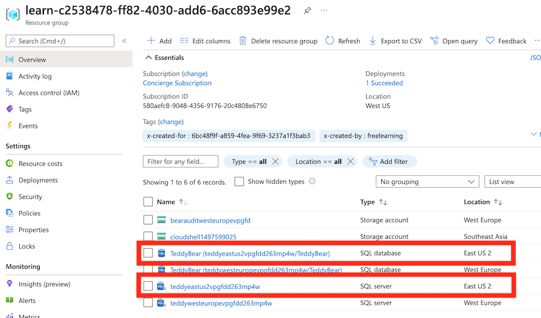
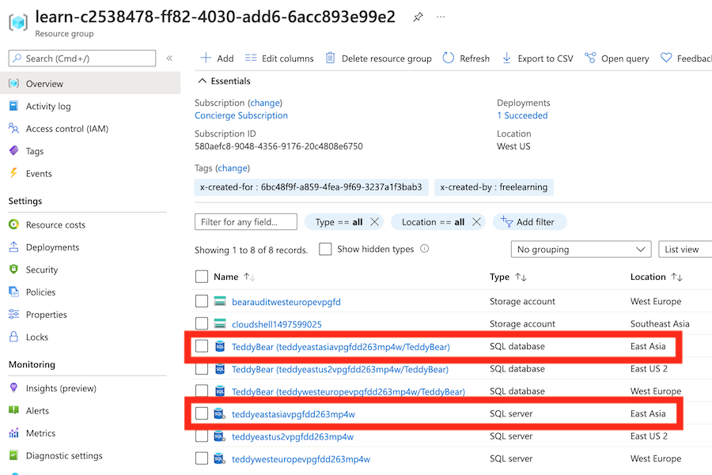

# Lab 05 - Deploy multiple resources by using loops

## Lab Scenario

## Lab objectives

## Estimated timing: 60 minutes

### Exercise - 

### Task 1: Move resources into a module

1. In Visual Studio Code, create a new folder called modules in the same folder where you created your main.bicep file.

1. Move your main.bicep file into the modules folder you just created.

1. Rename the main.bicep file to database.bicep.

### Task 2: Deploy multiple instances by using a copy loop

1. Create a new main.bicep file to replace the one you just moved and renamed.

1. Open the new main.bicep file, and add the following parameters:

    ```
    @description('The Azure regions into which the resources should be deployed.')
    param locations array = [
      'westeurope'
      'eastus2'
    ]
    
    @secure()
    @description('The administrator login username for the SQL server.')
    param sqlServerAdministratorLogin string
    
    @secure()
    @description('The administrator login password for the SQL server.')
    param sqlServerAdministratorLoginPassword string
    ```

1. Below the parameter declarations, add the following module declaration:

    ```
    module databases 'modules/database.bicep' = [for location in locations: {
      name: 'database-${location}'
      params: {
        location: location
        sqlServerAdministratorLogin: sqlServerAdministratorLogin
        sqlServerAdministratorLoginPassword: sqlServerAdministratorLoginPassword
      }
    }]
    ```

1. Save the changes to the file.

### Task 3: Verify your Bicep file

1. After you've completed all of the preceding changes, your main.bicep file should look like this example:

    ```
    @description('The Azure regions into which the resources should be deployed.')
    param locations array = [
      'westeurope'
      'eastus2'
    ]
    
    @secure()
    @description('The administrator login username for the SQL server.')
    param sqlServerAdministratorLogin string
    
    @secure()
    @description('The administrator login password for the SQL server.')
    param sqlServerAdministratorLoginPassword string
    
    module databases 'modules/database.bicep' = [for location in locations: {
      name: 'database-${location}'
      params: {
        location: location
        sqlServerAdministratorLogin: sqlServerAdministratorLogin
        sqlServerAdministratorLoginPassword: sqlServerAdministratorLoginPassword
      }
    }]
    ```
1. Your database.bicep file should look like this example:

    ```
    @description('The Azure region into which the resources should be deployed.')
    param location string
    
    @secure()
    @description('The administrator login username for the SQL server.')
    param sqlServerAdministratorLogin string
    
    @secure()
    @description('The administrator login password for the SQL server.')
    param sqlServerAdministratorLoginPassword string
    
    @description('The name and tier of the SQL database SKU.')
    param sqlDatabaseSku object = {
      name: 'Standard'
      tier: 'Standard'
    }
    
    @description('The name of the environment. This must be Development or Production.')
    @allowed([
      'Development'
      'Production'
    ])
    param environmentName string = 'Development'
    
    @description('The name of the audit storage account SKU.')
    param auditStorageAccountSkuName string = 'Standard_LRS'
    
    var sqlServerName = 'teddy${location}${uniqueString(resourceGroup().id)}'
    var sqlDatabaseName = 'TeddyBear'
    var auditingEnabled = environmentName == 'Production'
    var auditStorageAccountName = take('bearaudit${location}${uniqueString(resourceGroup().id)}', 24)
    
    resource sqlServer 'Microsoft.Sql/servers@2021-11-01-preview' = {
      name: sqlServerName
      location: location
      properties: {
        administratorLogin: sqlServerAdministratorLogin
        administratorLoginPassword: sqlServerAdministratorLoginPassword
      }
    }
    
    resource sqlDatabase 'Microsoft.Sql/servers/databases@2021-11-01-preview' = {
      parent: sqlServer
      name: sqlDatabaseName
      location: location
      sku: sqlDatabaseSku
    }
    
    resource auditStorageAccount 'Microsoft.Storage/storageAccounts@2021-09-01' = if (auditingEnabled) {
      name: auditStorageAccountName
      location: location
      sku: {
        name: auditStorageAccountSkuName
      }
      kind: 'StorageV2'  
    }
    
    resource sqlServerAudit 'Microsoft.Sql/servers/auditingSettings@2021-11-01-preview' = if (auditingEnabled) {
      parent: sqlServer
      name: 'default'
      properties: {
        state: 'Enabled'
        storageEndpoint: environmentName == 'Production' ? auditStorageAccount.properties.primaryEndpoints.blob : ''
        storageAccountAccessKey: environmentName == 'Production' ? listKeys(auditStorageAccount.id, auditStorageAccount.apiVersion).keys[0].value : ''
      }
    }
    ```
    >**Note**: If it doesn't, either copy the example or adjust your template to match the example.

### Task 4: Deploy the Bicep template to Azure

1. In the Visual Studio Code terminal, deploy the Bicep template to Azure by running the following Azure PowerShell command:

    ```
    New-AzResourceGroupDeployment -TemplateFile main.bicep
    ```

### Task 5: Verify the deployment

After the deployment is finished, you want to verify that the new logical server and database are deployed and that they're located in the correct Azure regions.

1. Go to the Azure portal, and make sure that you're in the sandbox subscription.

2. Select [sandbox resource group name].

3. Verify that new logical server and database are located in the East US 2 region, which you specified in the locations parameter's default value.

    

5. Leave the page open in your browser. You'll check on deployments again later.

### Task 6: Update and redeploy the template to Azure with an additional location for a logical server

The teddy bear toy team is about to launch again, this time into Asia. The team is asking you to deploy a new server and database in the East Asia region. To do so, you need to update your Bicep parameter and redeploy your template.

1. Return to Visual Studio Code. At the top of the main.bicep file, add a new value to the locations array:

    ```
    @description('The Azure regions into which the resources should be deployed.')
    param locations array = [
      'westeurope'
      'eastus2'
      'eastasia'
    ]
    ```

2. Save the changes to the file.

In the Visual Studio Code terminal, redeploy the file by running the following code:

    ```
    New-AzResourceGroupDeployment -TemplateFile main.bicep
    ```

### Task 7: Verify the redeployment
Now that you've redeployed the resources, you want to verify that the additional logical server and database resources have been created in the East Asia region.

1. Return to the Azure portal and select the [sandbox resource group name] resource group. If necessary, select Refresh to see the newly deployed resources.

2. Verify that the new logical server and database have been deployed in the East Asia region.

    
