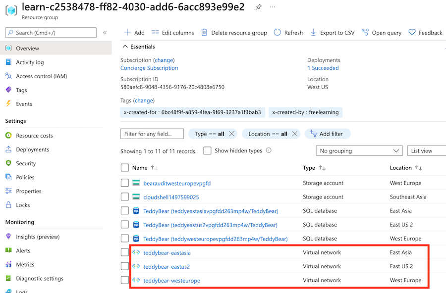
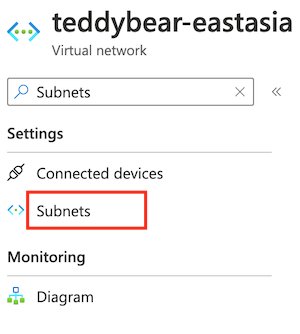
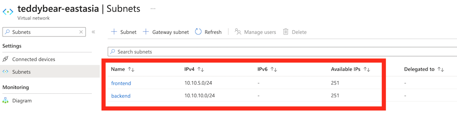
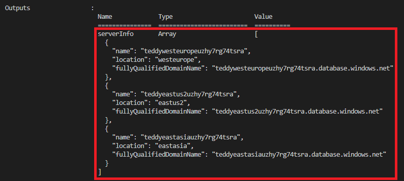

# Lab 01 - Use variable and output loops
## Lab Scenario

## Lab objectives

## Estimated timing: 60 minutes

### Exercise 1: Add the virtual network to your Bicep file

In this exercise, you will 

### Task 1: Add the virtual network to your Bicep file

1. Open the main.bicep file.

1. Below the parameter declarations, add the following parameters:

    ```
    @description('The IP address range for all virtual networks to use.')
    param virtualNetworkAddressPrefix string = '10.10.0.0/16'
    
    @description('The name and IP address range for each subnet in the virtual networks.')
    param subnets array = [
      {
        name: 'frontend'
        ipAddressRange: '10.10.5.0/24'
      }
      {
        name: 'backend'
        ipAddressRange: '10.10.10.0/24'
      }
    ]
    ```

1. Below the parameters, add a blank line, and then add the subnetProperties variable loop:

    ```
    var subnetProperties = [for subnet in subnets: {
      name: subnet.name
      properties: {
        addressPrefix: subnet.ipAddressRange
      }
    }]
    ```

1. At the bottom of the file, below the databases module loop, add the following resource loop:

    ```
    resource virtualNetworks 'Microsoft.Network/virtualNetworks@2021-08-01' = [for location in locations: {
      name: 'teddybear-${location}'
      location: location
      properties:{
        addressSpace:{
          addressPrefixes:[
            virtualNetworkAddressPrefix
          ]
        }
        subnets: subnetProperties
      }
    }]
    ```

1. Save the changes to the file.

### Task 2: Add outputs to the database module

1. Open the modules/database.bicep file.

2. At the bottom of the file, add the following outputs:

    ```
    output serverName string = sqlServer.name
    output location string = location
    output serverFullyQualifiedDomainName string = sqlServer.properties.fullyQualifiedDomainName
    ```
1. Save the changes to the file.

## Task 3: Flow the outputs through the parent Bicep file

1. Open the main.bicep file.

2. At the bottom of the file, add the following output loop:

    ```
    output serverInfo array = [for i in range(0, length(locations)): {
      name: databases[i].outputs.serverName
      location: databases[i].outputs.location
      fullyQualifiedDomainName: databases[i].outputs.serverFullyQualifiedDomainName
    }]
    ```

1. Save the changes to the file.

### Task 4: Verify your Bicep file

1. After you've completed all of the preceding changes, your main.bicep file should look like this example:

    ```
    @description('The Azure regions into which the resources should be deployed.')
    param locations array = [
      'westeurope'
      'eastus2'
      'eastasia'
    ]
    
    @secure()
    @description('The administrator login username for the SQL server.')
    param sqlServerAdministratorLogin string
    
    @secure()
    @description('The administrator login password for the SQL server.')
    param sqlServerAdministratorLoginPassword string
    
    @description('The IP address range for all virtual networks to use.')
    param virtualNetworkAddressPrefix string = '10.10.0.0/16'
    
    @description('The name and IP address range for each subnet in the virtual networks.')
    param subnets array = [
      {
        name: 'frontend'
        ipAddressRange: '10.10.5.0/24'
      }
      {
        name: 'backend'
        ipAddressRange: '10.10.10.0/24'
      }
    ]
    
    var subnetProperties = [for subnet in subnets: {
      name: subnet.name
      properties: {
        addressPrefix: subnet.ipAddressRange
      }
    }]
    
    module databases 'modules/database.bicep' = [for location in locations: {
      name: 'database-${location}'
      params: {
        location: location
        sqlServerAdministratorLogin: sqlServerAdministratorLogin
        sqlServerAdministratorLoginPassword: sqlServerAdministratorLoginPassword
      }
    }]
    
    resource virtualNetworks 'Microsoft.Network/virtualNetworks@2021-08-01' = [for location in locations: {
      name: 'teddybear-${location}'
      location: location
      properties:{
        addressSpace:{
          addressPrefixes:[
            virtualNetworkAddressPrefix
          ]
        }
        subnets: subnetProperties
      }
    }]
    
    output serverInfo array = [for i in range(0, length(locations)): {
      name: databases[i].outputs.serverName
      location: databases[i].outputs.location
      fullyQualifiedDomainName: databases[i].outputs.serverFullyQualifiedDomainName
    }]
    ```

1. Your database.bicep file should look like this example:

    ```
    @description('The Azure region into which the resources should be deployed.')
    param location string
    
    @secure()
    @description('The administrator login username for the SQL server.')
    param sqlServerAdministratorLogin string
    
    @secure()
    @description('The administrator login password for the SQL server.')
    param sqlServerAdministratorLoginPassword string
    
    @description('The name and tier of the SQL database SKU.')
    param sqlDatabaseSku object = {
      name: 'Standard'
      tier: 'Standard'
    }
    
    @description('The name of the environment. This must be Development or Production.')
    @allowed([
      'Development'
      'Production'
    ])
    param environmentName string = 'Development'
    
    @description('The name of the audit storage account SKU.')
    param auditStorageAccountSkuName string = 'Standard_LRS'
    
    var sqlServerName = 'teddy${location}${uniqueString(resourceGroup().id)}'
    var sqlDatabaseName = 'TeddyBear'
    var auditingEnabled = environmentName == 'Production'
    var auditStorageAccountName = take('bearaudit${location}${uniqueString(resourceGroup().id)}', 24)
    
    resource sqlServer 'Microsoft.Sql/servers@2021-11-01-preview' = {
      name: sqlServerName
      location: location
      properties: {
        administratorLogin: sqlServerAdministratorLogin
        administratorLoginPassword: sqlServerAdministratorLoginPassword
      }
    }
    
    resource sqlDatabase 'Microsoft.Sql/servers/databases@2021-11-01-preview' = {
      parent: sqlServer
      name: sqlDatabaseName
      location: location
      sku: sqlDatabaseSku
    }
    
    resource auditStorageAccount 'Microsoft.Storage/storageAccounts@2021-09-01' = if (auditingEnabled) {
      name: auditStorageAccountName
      location: location
      sku: {
        name: auditStorageAccountSkuName
      }
      kind: 'StorageV2'  
    }
    
    resource sqlServerAudit 'Microsoft.Sql/servers/auditingSettings@2021-11-01-preview' = if (auditingEnabled) {
      parent: sqlServer
      name: 'default'
      properties: {
        state: 'Enabled'
        storageEndpoint: environmentName == 'Production' ? auditStorageAccount.properties.primaryEndpoints.blob : ''
        storageAccountAccessKey: environmentName == 'Production' ? listKeys(auditStorageAccount.id, auditStorageAccount.apiVersion).keys[0].value : ''
      }
    }
    
    output serverName string = sqlServer.name
    output location string = location
    output serverFullyQualifiedDomainName string = sqlServer.properties.fullyQualifiedDomainName
    ```

### Task 5: Deploy the Bicep template to Azure

In the Visual Studio Code terminal, deploy the Bicep template to Azure by running the following Azure PowerShell command. This process can take a couple of minutes to finish, and then you'll have a successful deployment.

    ```
    New-AzResourceGroupDeployment -TemplateFile main.bicep
    ```

### Task 6: Verify the deployment
After the deployment is finished, you want to verify that new virtual networks are deployed and that they have subnets configured as you expect.

1. Go to the Azure portal and make sure that you're in the sandbox subscription.

1. Select [sandbox resource group name].

1. Verify that the virtual networks have been deployed to the three Azure locations.

    

1. Select the virtual network named teddybear-eastasia.

1. In the search bar, enter Subnets. Under Settings, select Subnets.

    
   
1. Verify that the deployed subnets have the names and IP addresses that were specified in the subnets parameter's default value.

    

1. Check the output of the deployment command. It should include the name and FQDN of all three of the logical servers that were deployed, as shown here:

    


