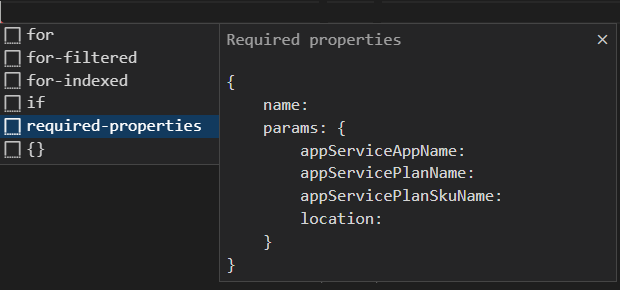
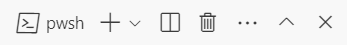
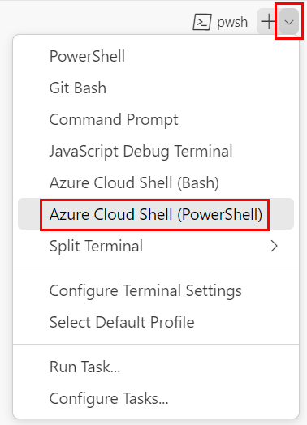
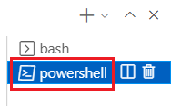
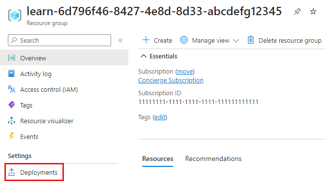
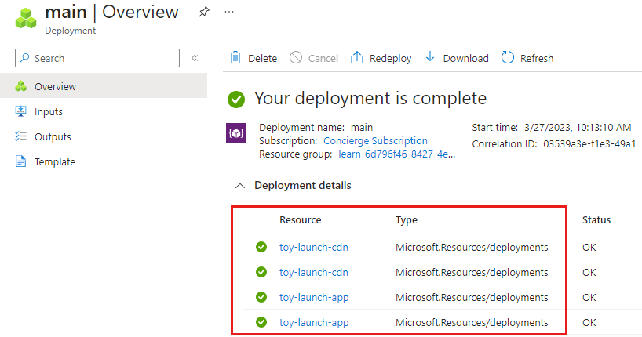
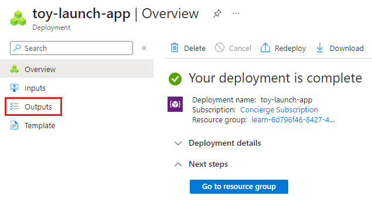
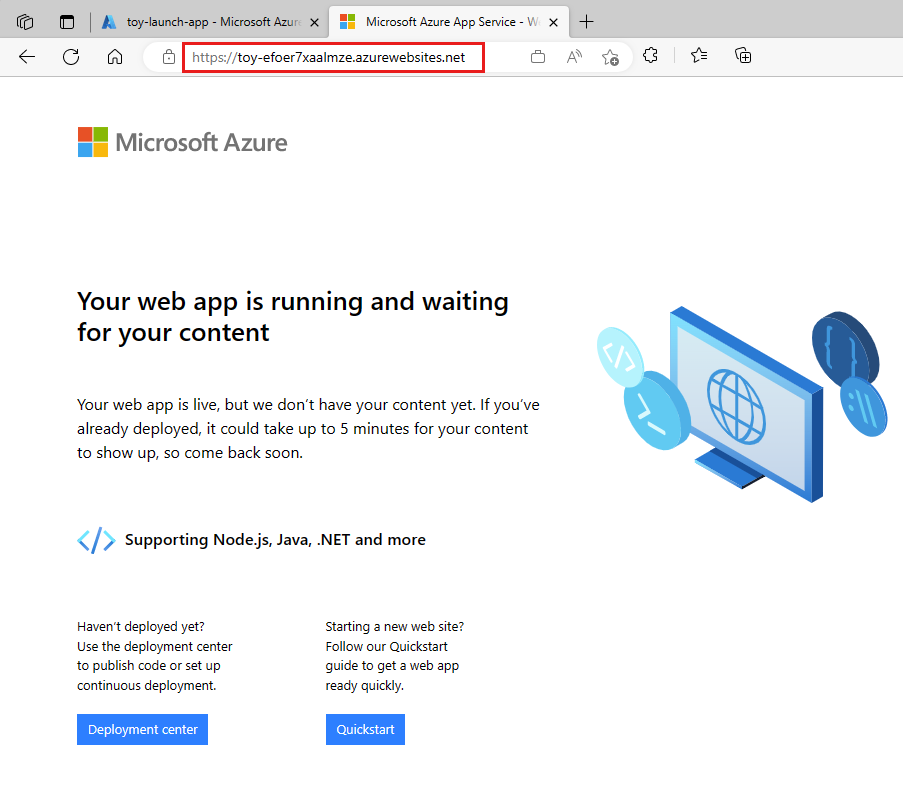
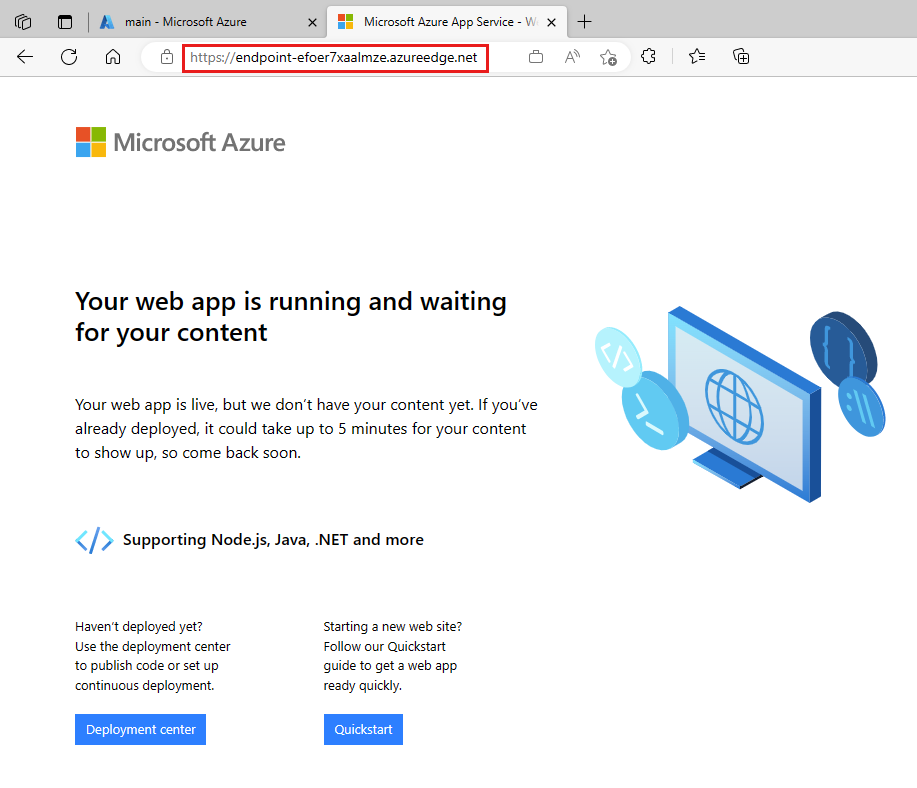

# Lab 07 - Create and use a module

## Lab Scenario

## Lab objectives

## Estimated timing: 60 minutes

### Exercise 1: Create a blank Bicep file

In this exercise, you will 

### Task 1: Create a blank Bicep file

1. Open Visual Studio Code.

1. Create a new file called main.bicep.

1. Save the empty file so that Visual Studio Code loads the Bicep tooling.

### Task 2: Create a module for your application

Create a new folder called modules in the same folder where you created your main.bicep file. In the modules folder, create a file called app.bicep. Save the file.

1. Add the following content into the app.bicep file:

    ```
    @description('The Azure region into which the resources should be deployed.')
    param location string
    
    @description('The name of the App Service app.')
    param appServiceAppName string
    
    @description('The name of the App Service plan.')
    param appServicePlanName string
    
    @description('The name of the App Service plan SKU.')
    param appServicePlanSkuName string
    
    resource appServicePlan 'Microsoft.Web/serverfarms@2022-03-01' = {
      name: appServicePlanName
      location: location
      sku: {
        name: appServicePlanSkuName
      }
    }
    
    resource appServiceApp 'Microsoft.Web/sites@2022-03-01' = {
      name: appServiceAppName
      location: location
      properties: {
        serverFarmId: appServicePlan.id
        httpsOnly: true
      }
    }
    
    @description('The default host name of the App Service app.')
    output appServiceAppHostName string = appServiceApp.properties.defaultHostName
    ```

1. Save the changes to the file.

### Task 3: Add the module to your Bicep template

Here, you add the app module to your Bicep template as a starting point.

1. Open the main.bicep file.

1. Add the following parameters and variable to the file:

    ```
    @description('The Azure region into which the resources should be deployed.')
    param location string = 'westus3'
    
    @description('The name of the App Service app.')
    param appServiceAppName string = 'toy-${uniqueString(resourceGroup().id)}'
    
    @description('The name of the App Service plan SKU.')
    param appServicePlanSkuName string = 'F1'
    
    var appServicePlanName = 'toy-product-launch-plan'
    ```

1. Below the parameters, create a blank line. Now, type the first line of the app module definition:

    ```
    module app 'modules/app.bicep' = {
    ```

1. Select Required properties from the pop-up menu:

    

1. Complete the module declaration:

    ```
    module app 'modules/app.bicep' = {
      name: 'toy-launch-app'
      params: {
        appServiceAppName: appServiceAppName
        appServicePlanName: appServicePlanName
        appServicePlanSkuName: appServicePlanSkuName
        location: location
      }
    }
    ```

1. At the bottom of the file, define an output:

    ```
    @description('The host name to use to access the website.')
    output websiteHostName string = app.outputs.appServiceAppHostName
    ```

1. Save the changes to the file.

### Task 4: Create a module for the content delivery network

1. In the modules folder, create a file called cdn.bicep. Save the file.

1. Add the following content into the cdn.bicep file:

    ```
    @description('The host name (address) of the origin server.')
    param originHostName string
    
    @description('The name of the CDN profile.')
    param profileName string = 'cdn-${uniqueString(resourceGroup().id)}'
    
    @description('The name of the CDN endpoint')
    param endpointName string = 'endpoint-${uniqueString(resourceGroup().id)}'
    
    @description('Indicates whether the CDN endpoint requires HTTPS connections.')
    param httpsOnly bool
    
    var originName = 'my-origin'
    
    resource cdnProfile 'Microsoft.Cdn/profiles@2022-11-01-preview' = {
      name: profileName
      location: 'global'
      sku: {
        name: 'Standard_Microsoft'
      }
    }
    
    resource endpoint 'Microsoft.Cdn/profiles/endpoints@2022-11-01-preview' = {
      parent: cdnProfile
      name: endpointName
      location: 'global'
      properties: {
        originHostHeader: originHostName
        isHttpAllowed: !httpsOnly
        isHttpsAllowed: true
        queryStringCachingBehavior: 'IgnoreQueryString'
        contentTypesToCompress: [
          'text/plain'
          'text/html'
          'text/css'
          'application/x-javascript'
          'text/javascript'
        ]
        isCompressionEnabled: true
        origins: [
          {
            name: originName
            properties: {
              hostName: originHostName
            }
          }
        ]
      }
    }
    
    @description('The host name of the CDN endpoint.')
    output endpointHostName string = endpoint.properties.hostName
    ```

1. Save the changes to the file.

### Task 5: Add the modules to the main Bicep template

1. Open the main.bicep file.

1. Below the appServicePlanSkuName parameter, add the following parameter:

    ```
    @description('Indicates whether a CDN should be deployed.')
    param deployCdn bool = true
    ```
1. Below the app module definition, define the cdn module:

    ```
    module cdn 'modules/cdn.bicep' = if (deployCdn) {
      name: 'toy-launch-cdn'
      params: {
        httpsOnly: true
        originHostName: app.outputs.appServiceAppHostName
      }
    }
    ```
    
1. Update the host name output so that it selects the correct host name. When a CDN is deployed, you want the host name to be that of the CDN endpoint.
    
    ```
    output websiteHostName string = deployCdn ? cdn.outputs.endpointHostName : app.outputs.appServiceAppHostName
    ```

1. Save the changes to the file.

### Task 6: Deploy the Bicep template to Azure
To deploy this template to Azure, sign in to your Azure account from the Visual Studio Code terminal. Be sure you've installed Azure PowerShell, and sign in to the same account that activated the sandbox.

1. On the Terminal menu, select New Terminal. The terminal window usually opens in the lower half of your screen.

1. If the shell shown on the right side of the terminal window is powershell or pwsh, the correct shell is open, and you can skip to the next section.

    

1. If a shell other than powershell or pwsh appears, select the shell dropdown arrow, and then select PowerShell.

    

1. In the list of terminal shells, select powershell or pwsh.

    

1. In the terminal, go to the directory where you saved your template. For example, if you saved your template in the templates folder, you can use this command:
    
    ```
    Set-Location -Path templates
    ```

### Install the Bicep CLI

To use Bicep from Azure PowerShell, install the Bicep CLI.

### Sign in to Azure by using Azure PowerShell

In the Visual Studio Code terminal, run the following command:

    ```
    Connect-AzAccount
    ```

1. After you've signed in to Azure, the terminal displays a list of the subscriptions associated with this account.

1. Set the default subscription for all of the Azure PowerShell commands that you run in this session.

    ```
    $context = Get-AzSubscription -SubscriptionName 'Concierge Subscription'
    Set-AzContext $context
    ```

1. Get the subscription ID. Running the following command lists your subscriptions and their IDs. Look for Concierge Subscription, and then copy the ID from the second column. It looks something like cf49fbbc-217c-4eb6-9eb5-a6a6c68295a0.

    ```
    Get-AzSubscription
    ```

1. Change your active subscription to Concierge Subscription. Be sure to replace {Your subscription ID} with the one that you copied.

    ```
    $context = Get-AzSubscription -SubscriptionId {Your subscription ID}
    Set-AzContext $context
    ```

### Set the default resource group

You can set the default resource group and omit the parameter from the rest of the Azure PowerShell commands in this exercise. Set this default to the resource group created for you in the sandbox environment.

    ```
    Set-AzDefault -ResourceGroupName [sandbox resource group name]
    ```

### Deploy the template to Azure

Deploy the template to Azure by using the following Azure PowerShell command in the terminal. This can take a minute or two to finish, and then you'll get a successful deployment.

    ```
    New-AzResourceGroupDeployment -TemplateFile main.bicep
    ```

### Review the deployment history

1. Go to the Azure portal and make sure you're in the sandbox subscription:
  a. Select your avatar in the upper-right corner of the page.
  b. Select Switch directory. In the list, choose the Microsoft Learn Sandbox directory.

1. On the left-side panel, select Resource groups.

1. Select [sandbox resource group name].

1. On the left menu, select Deployments.

    

1. Select the main deployment and expand Deployment details.

    

1. Select the toy-launch-cdn and toy-launch-app deployments and review the resources deployed in each. Notice that they correspond to the resources defined in the respective module.

### Test the website

1. Select the toy-launch-app deployment.

1. Select Outputs.

    

1. Select the copy button for the appServiceAppHostName output.

1. On a new browser tab, try to go to the address that you copied in the previous step. The address should begin with https://.

    

1. Go to the main deployment and select Outputs.

1. Copy the value of the websiteHostName output. Notice that this host name is different, because it's an Azure Content Delivery Network host name.

1. On a new browser tab, try to go to the host name that you copied in the previous step. Add https:// to the start of the address.

    
